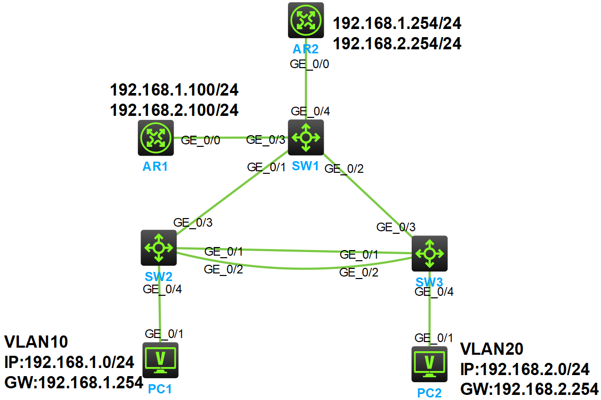

### 实验拓扑

### 实验需求
1. 全网VLAN划分：VLAN 10、VLAN 20
2. 交换机间链路聚合，提高冗余和带宽
3. 启用STP，边缘端口加速终端接入
4. 路由器AR1做单臂路由 + DHCP服务器，为VLAN 10/20分配地址
5. 路由器AR2做单臂路由，作为VLAN 10/20的网关
6. 实现所有终端互通（包括跨VLAN通信）
### 配置步骤
#### 1.配置链路聚合
```
交换机3的配置：
interface Bridge-Aggregation 1
interface g1/0/1
port link-aggregation group 1
interface g1/0/2
port link-aggregation group 1
quit
interface Bridge-Aggregation 1
port link-type trunk
port trunk permit vlan all
quit

交换机2的配置：
interface Bridge-Aggregation 1
interface g1/0/1
port link-aggregation group 1
interface g1/0/2
port link-aggregation group 1
quit
interface Bridge-Aggregation 1
port link-type trunk
port trunk permit vlan all
quit
```
#### 2.配置VLAN
```
交换机1的配置：
vlan 10
vlan 20
quit
int range g1/0/1 to g1/0/4
port link-type trunk
port trunk permit vlan 10 20
quit

交换机2的配置：
vlan 10
port g1/0/4
vlan 20
quit
int g1/0/3
port link-type trunk
port trunk permit vlan 10 20
quit

交换机3的配置：
vlan 20
port g1/0/4
vlan 10
quit
int g1/0/3
port link-type trunk
port trunk permit vlan 10 20
quit
```
#### 3.STP配置
```
交换机2的配置：
int g1/0/4
stp edged-port

交换机3的配置：
int g1/0/4
stp edged-port
```
#### 4.配置AR1的DHCP和单臂路由
```
路由器1的配置如下：
interface g0/0.1
vlan-type dot1q vid 10
ip address 192.168.1.100 24
quit
interface g0/0.2
vlan-type dot1q vid 20
ip address 192.168.2.100 24
quit

dhcp enable
dhcp server forbidden-ip 192.168.1.254
dhcp server forbidden-ip 192.168.2.254
dhcp server forbidden-ip 192.168.1.100
dhcp server forbidden-ip 192.168.2.100
dhcp server ip-pool 1
network 192.168.1.0 mask 255.255.255.0
gateway-list 192.168.1.254
quit
dhcp server ip-pool 2
network 192.168.2.0 mask 255.255.255.0
gateway-list 192.168.2.254
quit
```
#### 5.配置AR2的单臂路由
```
路由器2的配置如下：
interface g0/0.1
vlan-type dot1q vid 10
ip address 192.168.1.254 24
quit
interface g0/0.2
vlan-type dot1q vid 20
ip address 192.168.2.254 24
quit
```
#### 6.结果验证

**链路聚合状态验证：** 使用display link-aggregation verbose命令查看交换机2和3的链路聚合情况
```
[SW2]display link-aggregation verbose
Loadsharing Type: Shar -- Loadsharing, NonS -- Non-Loadsharing
Port: A -- Auto
Port Status: S -- Selected, U -- Unselected, I -- Individual
Flags:  A -- LACP_Activity, B -- LACP_Timeout, C -- Aggregation,
        D -- Synchronization, E -- Collecting, F -- Distributing,
        G -- Defaulted, H -- Expired

Aggregate Interface: Bridge-Aggregation1
Aggregation Mode: Static
Loadsharing Type: Shar
  Port             Status  Priority Oper-Key
--------------------------------------------------------------------------------
  GE1/0/1          S       32768    1
  GE1/0/2          S       32768    1


[SW3]dis link-aggregation verbose
Loadsharing Type: Shar -- Loadsharing, NonS -- Non-Loadsharing
Port: A -- Auto
Port Status: S -- Selected, U -- Unselected, I -- Individual
Flags:  A -- LACP_Activity, B -- LACP_Timeout, C -- Aggregation,
        D -- Synchronization, E -- Collecting, F -- Distributing,
        G -- Defaulted, H -- Expired

Aggregate Interface: Bridge-Aggregation1
Aggregation Mode: Static
Loadsharing Type: Shar
  Port             Status  Priority Oper-Key
--------------------------------------------------------------------------------
  GE1/0/1          S       32768    1
  GE1/0/2          S       32768    1
[SW3]
```

**DHCP地址分配验证：** 查看PC1和PC2是否获取了IP地址


**连通性验证：**

让PC1 ping PC2和网关，发现能ping通：

让PC2 ping PC1和网关，发现能ping通：

