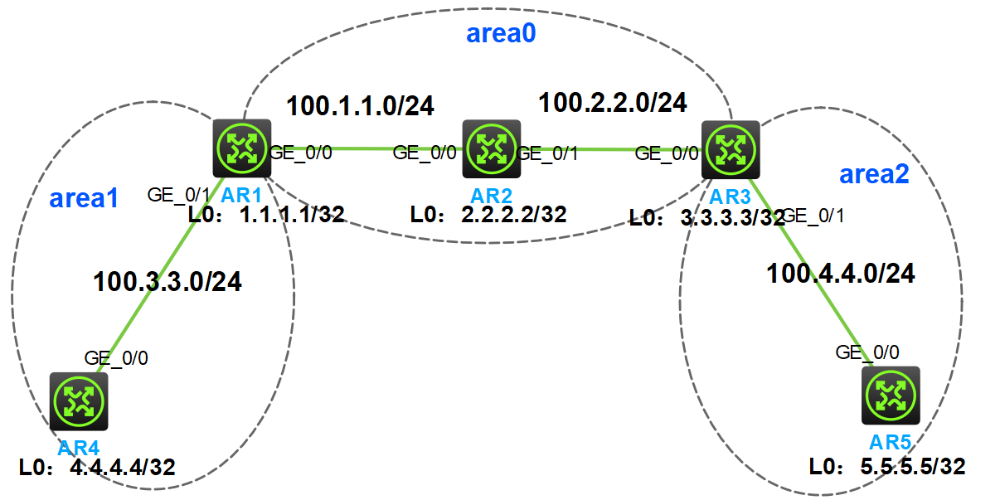

### 实验拓扑

### 实验需求
1. 按照图示配置 IP 地址
2. 按照图示分区域配置 OSPF ，实现全网互通
3. 为了路由结构稳定，要求路由器使用环回口作为 Router-id，ABR 的环回口宣告进骨干区域
### 配置步骤
#### 1.配置 IP 地址
```
路由器1的配置如下：
interface loopback 0
ip add 1.1.1.1 32
int g0/0
ip add 100.1.1.1 24
int g0/1
ip add 100.3.3.1 24

路由器2的配置如下：
interface loopback 0
ip add 2.2.2.2 32
int g0/0
ip add 100.1.1.2 24
int g0/1
ip add 100.2.2.2 24

路由器3的配置如下：
interface loopback 0
ip add 3.3.3.3 32
int g0/0
ip add 100.2.2.3 24
int g0/1
ip add 100.4.4.3 24

路由器4的配置如下：
interface loopback 0
ip add 4.4.4.4 32
int g0/0
ip add 100.3.3.4 24

路由器5的配置如下：
interface loopback 0
ip add 5.5.5.5 32
int g0/0
ip add 100.4.4.5 24
```
#### 2.按照图示分区域配置 OSPF ，实现全网互通
**分析：** 实现全网互通，意味着每台路由器都要宣告本地的所有直连网段，包括环回口所在的网段。要求 ABR 的环回口宣告进骨干区域，即区域 0，同时，每台路由器手动配置各自环回口的 IP 地址作为 Router-id。

在路由器上分别配置 OSPF，按区域宣告所有直连网段和环回口
```
路由器1的配置如下：
ospf 1 router-id 1.1.1.1
area 0
network 1.1.1.1 0.0.0.0
network 100.1.1.0 0.0.0.255
area 1
network 100.3.3.0 0.0.0.255

路由器2的配置如下：
ospf 1 router-id 2.2.2.2
area 0
network 2.2.2.2 0.0.0.0
network 100.1.1.0 0.0.0.255
network 100.2.2.0 0.0.0.255

路由器3的配置如下：
ospf 1 router-id 3.3.3.3
area 0
network 3.3.3.3 0.0.0.0
network 100.2.2.0 0.0.0.255
area 2
network 100.4.4.0 0.0.0.255

路由器4的配置如下：
ospf 1 router-id 4.4.4.4
area 1
network 4.4.4.4 0.0.0.0
network 100.3.3.0 0.0.0.255

路由器5的配置如下：
ospf 1 router-id 5.5.5.5
area 2
network 5.5.5.5 0.0.0.0
network 100.4.4.0 0.0.0.255
```
#### 3.检查是否全网互通
分析：检查 OSPF 是否全网互通，一个是检查邻居关系表，看邻居关系是否正常；另一个是检查路由表，看是否学习到全网路由。

下面只展示 R1 的检查结果。

步骤 1：检查 R1 的邻居关系表
```
[AR1]dis ospf peer

         OSPF Process 1 with Router ID 1.1.1.1
               Neighbor Brief Information

 Area: 0.0.0.0
 Router ID       Address         Pri Dead-Time  State             Interface
 2.2.2.2         100.1.1.2       1   34         Full/DR           GE0/0

 Area: 0.0.0.1
 Router ID       Address         Pri Dead-Time  State             Interface
 4.4.4.4         100.3.3.4       1   38         Full/DR           GE0/1

```
说明：可以看到，R1 分别和 R2 和 R4 建立了邻接关系，状态为 FULL，邻居关系正常。

步骤 2：检查 R1 的路由表
```text "O_INTRA" "O_INTER"
[AR1]display ip routing-table

Destinations : 20       Routes : 20

Destination/Mask   Proto   Pre Cost        NextHop         Interface
0.0.0.0/32         Direct  0   0           127.0.0.1       InLoop0
1.1.1.1/32         Direct  0   0           127.0.0.1       InLoop0
2.2.2.2/32         O_INTRA 10  1           100.1.1.2       GE0/0
3.3.3.3/32         O_INTRA 10  2           100.1.1.2       GE0/0
4.4.4.4/32         O_INTRA 10  1           100.3.3.4       GE0/1
5.5.5.5/32         O_INTER 10  3           100.1.1.2       GE0/0
100.1.1.0/24       Direct  0   0           100.1.1.1       GE0/0
100.1.1.1/32       Direct  0   0           127.0.0.1       InLoop0
100.1.1.255/32     Direct  0   0           100.1.1.1       GE0/0
100.2.2.0/24       O_INTRA 10  2           100.1.1.2       GE0/0
100.3.3.0/24       Direct  0   0           100.3.3.1       GE0/1
100.3.3.1/32       Direct  0   0           127.0.0.1       InLoop0
100.3.3.255/32     Direct  0   0           100.3.3.1       GE0/1
100.4.4.0/24       O_INTER 10  3           100.1.1.2       GE0/0
127.0.0.0/8        Direct  0   0           127.0.0.1       InLoop0
127.0.0.1/32       Direct  0   0           127.0.0.1       InLoop0
127.255.255.255/32 Direct  0   0           127.0.0.1       InLoop0
224.0.0.0/4        Direct  0   0           0.0.0.0         NULL0
224.0.0.0/24       Direct  0   0           0.0.0.0         NULL0
255.255.255.255/32 Direct  0   0           127.0.0.1       InLoop0
```
说明：可以看到，R1 已经学习到了全网所有网段的路由信息